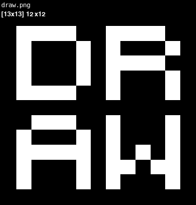

# tools
>Usage instructions are located inside the source.

"Useful tools for useless people"  
tools: `draw`

## draw
  
**"a simple drawing tool"**  
version: `0.9`  
needs: `python3, pygame`  
usage: `draw <file>`  

features:
* generates random filenames for lazy people.
* only works with square images.
* supports 8 different colors.
* highly customizable code.

todo:
* effects (outlines).
* alpha channel (transparency).
* additional brushes / tools.
* undo / redo tool.
* replace tool.
